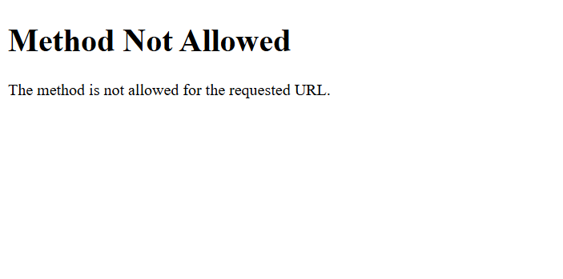

# 🚀 Guía Rápida de Despliegue en Render

## ✅ Código Subido a GitHub

Repositorio: https://github.com/StarLord133/api_tresa
Branch: main
Commit: "Add exam monitoring system with YOLO detection..."

---

## 📝 Paso 1: Desplegar Servidor Python en Render

### 1.1 Ir a Render.com
```
https://render.com/
```

### 1.2 Crear Nuevo Web Service
1. Click "New +" → "Web Service"
2. Conectar repositorio: `StarLord133/api_tresa`
3. Click "Connect"

### 1.3 Configurar el Servicio

**Name**: `exam-detection-server` (o el que prefieras)

**Region**: Oregon (US West) o el más cercano

**Branch**: `main`

**Root Directory**: `api_proy_final`

**Runtime**: `Python 3`

**Build Command**:
```bash
pip install -r requirements_exam.txt
```

**Start Command**:
```bash
  gunicorn server_exam_detection:app --timeout 120 --bind 0.0.0.0:$PORT
```

**Instance Type**: 
- **Free** (para pruebas, se duerme después de 15 min)
- **Starter** ($7/mes, recomendado para producción)

### 1.4 Variables de Entorno

Click "Advanced" → "Add Environment Variable"

Agregar estas variables:

```
ESP32_IP = http://192.168.0.139
CONFIDENCE = 0.45
NODE_BACKEND_URL = https://api-tresa.onrender.com
GCS_BUCKET = exam-monitoring-tresa
PORT = 10000
```

**GOOGLE_CLOUD_CREDENTIALS**:
```
Copiar TODO el contenido de ESP32CAM_ModoExamen/credenciales.txt
(desde { hasta } incluyendo las llaves)
```

### 1.5 Deploy

1. Click "Create Web Service"
2. Esperar ~5-10 minutos
3. Render descargará YOLOv8 (~6MB) en primera ejecución

### 1.6 Verificar Logs

En la pestaña "Logs" deberías ver:
```
📦 Cargando YOLO...
Downloading https://github.com/ultralytics/assets/releases/download/v8.3.0/yolov8n.pt...
✓ YOLO cargado
✓ Google Cloud Storage conectado: exam-monitoring-tresa
🎓 Servidor de Detección de Examen
Puerto: 10000
```

### 1.7 Probar el Servicio

URL del servicio: `https://exam-detection-server-XXXX.onrender.com`

Probar health check:
```
https://exam-detection-server-XXXX.onrender.com/health
```

Deberías ver:
```json
{
  "status": "ok",
  "yolo_loaded": true,
  "gcs_available": true,
  "exam_active": false
}
```

---

## 🟢 Paso 2: Actualizar Node.js Backend

### 2.1 El código ya está en GitHub ✅

Los endpoints ya están en `server_exam_endpoints.js`

### 2.2 Integrar en server.js


**OPCIÓN B: Ya lo hiciste antes** (si ya agregaste los endpoints)

### 2.3 Instalar axios

En tu proyecto local:
```bash
cd api_proy_final
npm install axios
```

### 2.4 Commit y Push

```bash
git add server.js package.json package-lock.json
git commit -m "Integrate exam monitoring endpoints"
git push origin main
```

### 2.5 Configurar Variable de Entorno en Render

1. Ir a tu servicio Node.js en Render
2. Environment → Add Environment Variable
3. Agregar:
   ```
   PYTHON_SERVER_URL = https://exam-detection-server-XXXX.onrender.com
   ```
   (Reemplazar XXXX con tu URL real)

### 2.6 Render Auto-Desplegará

Esperar ~2-3 minutos

### 2.7 Verificar

Probar endpoint:
```
https://api-tresa.onrender.com/api/exam/status
```

---

## ⚛️ Paso 3: Dashboard React (Ya Está Listo)

El código ya está en GitHub y funcionará automáticamente cuando:
1. Node.js backend esté actualizado
2. Python server esté corriendo

### Verificar Variable de Entorno

En tu dashboard (Vercel/Netlify), asegúrate que existe:
```
VITE_API_URL = https://api-tresa.onrender.com
```

---

## 🔌 Paso 4: Configurar ESP32-CAM con Ngrok

### 4.1 Instalar Ngrok

**Windows**:
```bash
# Descargar de https://ngrok.com/download
# O con chocolatey:
choco install ngrok
```

### 4.2 Ejecutar Ngrok

```bash
ngrok http 80 --host-header=192.168.0.139
```

Verás algo como:
```
Forwarding  https://abc123.ngrok.io -> http://192.168.0.139:80
```

### 4.3 Actualizar ESP32_IP en Render

1. Ir a servicio Python en Render
2. Environment → Edit `ESP32_IP`
3. Cambiar a: `https://abc123.ngrok.io`
4. Save Changes
5. Render reiniciará automáticamente

---

## 🧪 Paso 5: Probar Todo el Flujo

### 5.1 Desde el Dashboard

1. Ir a: `https://tu-dashboard.vercel.app/exam-monitor`
2. Click "Iniciar Examen"
3. Esperar ~2 segundos
4. Debería cambiar a "Activo"

### 5.2 Probar Detección

1. Acercar celular a la ESP32-CAM
2. Esperar ~3-5 segundos
3. Debería aparecer alerta en el dashboard
4. Verificar que imagen se guardó en Google Cloud Storage

### 5.3 Verificar en Google Cloud

```
https://console.cloud.google.com/storage/browser/exam-monitoring-tresa/exam_incidents
```

Deberías ver las imágenes guardadas.

---

## 📊 URLs Finales

```
Dashboard:        https://tu-dashboard.vercel.app/exam-monitor
Node.js API:      https://api-tresa.onrender.com
Python Server:    https://exam-detection-server-XXXX.onrender.com
ESP32-CAM:        https://abc123.ngrok.io (temporal)
GCS Bucket:       https://console.cloud.google.com/storage/browser/exam-monitoring-tresa
```

---

## ⚠️ Notas Importantes

### Ngrok URL Cambia
- La URL de ngrok cambia cada vez que lo reinicias
- Necesitas actualizar `ESP32_IP` en Render cada vez
- Para URL permanente: Ngrok Pro ($8/mes) o port forwarding en router

### Free Tier de Render
- Se duerme después de 15 min de inactividad
- Primera request tarda ~30 segundos en despertar
- Para producción: usar plan Starter ($7/mes)

### YOLO Tarda en Cargar
- Primera vez: ~30-60 segundos
- Descargar modelo: ~6MB
- Logs mostrarán progreso

---

## 🎯 Checklist Final

- [ ] Python server desplegado en Render
- [ ] Health check funciona
- [ ] Node.js actualizado con endpoints
- [ ] axios instalado
- [ ] PYTHON_SERVER_URL configurado
- [ ] Ngrok corriendo
- [ ] ESP32_IP actualizado con URL de ngrok
- [ ] Dashboard puede iniciar examen
- [ ] Detección funciona
- [ ] Imágenes se guardan en GCS
- [ ] Alertas aparecen en dashboard

---

## 🆘 Troubleshooting

### Python: "Module not found"
- Verificar que `requirements_exam.txt` esté en root directory
- Verificar Build Command en Render

### Python: "ESP32-CAM not reachable"
- Verificar que ngrok esté corriendo
- Verificar ESP32_IP en variables de entorno
- Probar manualmente: `curl https://ngrok-url/capture`

### Node.js: "Failed to start exam"
- Verificar PYTHON_SERVER_URL
- Verificar que Python server esté despierto
- Ver logs de Node.js en Render

### Dashboard: No aparecen alertas
- Verificar tabla `exam_alerts` en MySQL
- Verificar logs de Node.js
- Verificar CORS

---

**¡Listo para desplegar! Sigue los pasos en orden.** 🚀
